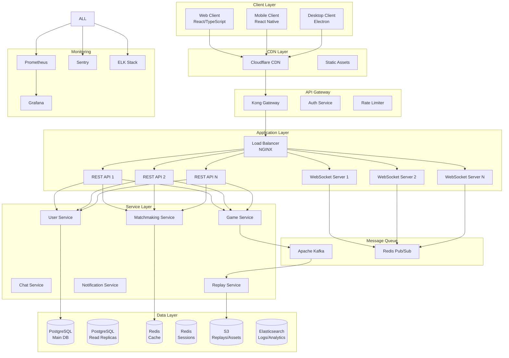

# Enterprise-Grade Multiplayer Implementation Plan for Pilotta Game

## Executive Summary

This document presents a comprehensive, production-ready implementation plan for transforming the Pilotta card game into a scalable, secure, and reliable multiplayer platform. This plan follows enterprise software development best practices and addresses all aspects required for a commercial-grade gaming platform.

## Table of Contents

1. [Business Requirements & Success Metrics](#1-business-requirements--success-metrics)
2. [Technical Architecture](#2-technical-architecture)
3. [Security & Compliance Framework](#3-security--compliance-framework)
4. [Infrastructure & DevOps](#4-infrastructure--devops)
5. [Development Methodology](#5-development-methodology)
6. [Quality Assurance Strategy](#6-quality-assurance-strategy)
7. [Risk Management](#7-risk-management)
8. [Implementation Phases](#8-implementation-phases)
9. [Monitoring & Analytics](#9-monitoring--analytics)
10. [Documentation & Knowledge Transfer](#10-documentation--knowledge-transfer)

---

## 1. Business Requirements & Success Metrics

### 1.1 Functional Requirements

#### Core Gaming Features
- **FR-001**: Support 2-4 human players per game
- **FR-002**: Support mixed human/AI games
- **FR-003**: Real-time synchronization with <100ms latency (regional)
- **FR-004**: Automatic reconnection within 60 seconds
- **FR-005**: Spectator mode with 30-second delay
- **FR-006**: Tournament support with Swiss/elimination brackets
- **FR-007**: Replay system for completed games
- **FR-008**: Chat system with moderation

#### User Management
- **FR-009**: Guest play without registration
- **FR-010**: Full account system with profiles
- **FR-011**: Friend lists and private games
- **FR-012**: Ranking and matchmaking system
- **FR-013**: Achievement and progression system

### 1.2 Non-Functional Requirements

#### Performance Requirements
- **NFR-001**: Support 10,000 concurrent users (initial)
- **NFR-002**: Support 100,000 concurrent users (scaled)
- **NFR-003**: 99.9% uptime SLA
- **NFR-004**: <50ms server response time (p95)
- **NFR-005**: <2 second game start time
- **NFR-006**: Horizontal scaling capability

#### Security Requirements
- **NFR-007**: OWASP Top 10 compliance
- **NFR-008**: GDPR/CCPA compliance
- **NFR-009**: PCI DSS compliance (if payments added)
- **NFR-010**: SOC 2 Type II certification ready
- **NFR-011**: End-to-end encryption for sensitive data

### 1.3 Success Metrics (KPIs)

```yaml
User Engagement:
  - Daily Active Users (DAU): 10,000 (3 months), 50,000 (6 months)
  - Session Duration: >20 minutes average
  - Games per User per Day: >3
  - User Retention: 40% (Day 7), 20% (Day 30)

Technical Performance:
  - Server Uptime: >99.9%
  - Average Latency: <100ms
  - Crash Rate: <0.1%
  - Connection Success Rate: >99.5%

Business Metrics:
  - Cost per User: <$0.05/month
  - User Acquisition Cost: <$2
  - Conversion Rate (Guest to Registered): >15%
  - Support Ticket Rate: <1%
```

---

## 2. Technical Architecture

### 2.1 System Architecture



### 2.2 Technology Stack

#### Backend
```yaml
Runtime:
  - Node.js 20 LTS (primary services)
  - Go 1.21 (high-performance services)
  
Frameworks:
  - NestJS (REST APIs)
  - Socket.io (WebSocket)
  - Express (lightweight services)
  
Databases:
  - PostgreSQL 15 (primary data)
  - Redis 7 (cache/sessions/pub-sub)
  - MongoDB (chat history)
  - ClickHouse (analytics)
  
Message Queues:
  - Apache Kafka (event streaming)
  - RabbitMQ (task queues)
  
Search:
  - Elasticsearch 8 (logs/search)
```

#### Frontend
```yaml
Web:
  - React 18
  - TypeScript 5
  - Redux Toolkit + RTK Query
  - Socket.io-client
  - Tailwind CSS
  - Vite

Mobile:
  - React Native
  - Expo (managed workflow)
  - Redux Persist
  - React Navigation

Desktop:
  - Electron
  - Shared React codebase
```

### 2.3 Microservices Architecture

#### Service Definitions

```typescript
// services/game-service/src/game.service.ts
@Injectable()
export class GameService {
  constructor(
    private readonly gameEngine: GameEngine,
    private readonly stateManager: StateManager,
    private readonly eventBus: EventBus,
    private readonly cache: CacheService,
  ) {}

  async createGame(options: CreateGameDto): Promise<Game> {
    const game = await this.gameEngine.createGame(options);
    await this.stateManager.saveState(game);
    await this.eventBus.publish('game.created', game);
    return game;
  }

  async processAction(gameId: string, action: GameAction): Promise<GameState> {
    // Distributed lock to prevent race conditions
    const lock = await this.cache.acquireLock(`game:${gameId}`, 5000);
    
    try {
      const state = await this.stateManager.getState(gameId);
      const newState = await this.gameEngine.processAction(state, action);
      
      await this.stateManager.saveState(newState);
      await this.eventBus.publish('game.action', { gameId, action, newState });
      
      return newState;
    } finally {
      await lock.release();
    }
  }
}
```

#### Service Communication

```yaml
Synchronous:
  - gRPC for internal service communication
  - REST for public APIs
  - GraphQL for complex queries

Asynchronous:
  - Kafka for event streaming
  - RabbitMQ for task processing
  - Redis Pub/Sub for real-time updates
```

### 2.4 Data Models

#### Core Entities

```sql
-- users table
CREATE TABLE users (
    id UUID PRIMARY KEY DEFAULT gen_random_uuid(),
    username VARCHAR(50) UNIQUE NOT NULL,
    email VARCHAR(255) UNIQUE NOT NULL,
    password_hash VARCHAR(255) NOT NULL,
    created_at TIMESTAMP WITH TIME ZONE DEFAULT NOW(),
    updated_at TIMESTAMP WITH TIME ZONE DEFAULT NOW(),
    last_login_at TIMESTAMP WITH TIME ZONE,
    status VARCHAR(20) DEFAULT 'active',
    metadata JSONB DEFAULT '{}'::jsonb
);

-- games table
CREATE TABLE games (
    id UUID PRIMARY KEY DEFAULT gen_random_uuid(),
    room_code VARCHAR(10) UNIQUE NOT NULL,
    status VARCHAR(20) NOT NULL,
    created_at TIMESTAMP WITH TIME ZONE DEFAULT NOW(),
    started_at TIMESTAMP WITH TIME ZONE,
    ended_at TIMESTAMP WITH TIME ZONE,
    game_mode VARCHAR(50) NOT NULL,
    settings JSONB NOT NULL,
    state JSONB NOT NULL,
    version INTEGER DEFAULT 1
);

-- game_players table
CREATE TABLE game_players (
    game_id UUID REFERENCES games(id),
    user_id UUID REFERENCES users(id),
    position INTEGER NOT NULL,
    team VARCHAR(1) NOT NULL,
    is_ai BOOLEAN DEFAULT FALSE,
    joined_at TIMESTAMP WITH TIME ZONE DEFAULT NOW(),
    left_at TIMESTAMP WITH TIME ZONE,
    PRIMARY KEY (game_id, user_id)
);

-- game_actions table (event sourcing)
CREATE TABLE game_actions (
    id BIGSERIAL PRIMARY KEY,
    game_id UUID REFERENCES games(id),
    player_id UUID REFERENCES users(id),
    action_type VARCHAR(50) NOT NULL,
    action_data JSONB NOT NULL,
    timestamp TIMESTAMP WITH TIME ZONE DEFAULT NOW(),
    sequence_number INTEGER NOT NULL
);

CREATE INDEX idx_game_actions_game_id ON game_actions(game_id);
CREATE INDEX idx_game_actions_timestamp ON game_actions(timestamp);
```

---

## 3. Security & Compliance Framework

### 3.1 Security Architecture

#### Authentication & Authorization

```typescript
// auth/src/auth.service.ts
@Injectable()
export class AuthService {
  async authenticate(credentials: LoginDto): Promise<AuthResult> {
    // Multi-factor authentication support
    const user = await this.validateCredentials(credentials);
    
    if (user.mfaEnabled) {
      return this.initiateMFA(user);
    }
    
    return this.generateTokens(user);
  }

  private async generateTokens(user: User): Promise<TokenPair> {
    const payload = {
      sub: user.id,
      username: user.username,
      roles: user.roles,
    };

    const [accessToken, refreshToken] = await Promise.all([
      this.jwtService.signAsync(payload, { expiresIn: '15m' }),
      this.jwtService.signAsync(payload, { expiresIn: '7d' }),
    ]);

    // Store refresh token hash
    await this.cacheService.set(
      `refresh:${user.id}`,
      await bcrypt.hash(refreshToken, 10),
      7 * 24 * 60 * 60
    );

    return { accessToken, refreshToken };
  }
}
```

#### Input Validation & Sanitization

```typescript
// Common validation schemas
const actionValidationSchemas = {
  PLAY_CARD: Joi.object({
    type: Joi.string().valid('PLAY_CARD').required(),
    cardId: Joi.string().uuid().required(),
    timestamp: Joi.number().required(),
  }),
  
  BID: Joi.object({
    type: Joi.string().valid('BID').required(),
    bid: Joi.object({
      suit: Joi.string().valid('H', 'D', 'C', 'S', 'NT').required(),
      value: Joi.number().min(80).max(160).required(),
    }).required(),
  }),
};

// Validation middleware
export class ValidationPipe implements PipeTransform {
  transform(value: any, metadata: ArgumentMetadata) {
    const schema = actionValidationSchemas[value.type];
    if (!schema) {
      throw new BadRequestException('Invalid action type');
    }
    
    const { error } = schema.validate(value);
    if (error) {
      throw new BadRequestException(error.details[0].message);
    }
    
    return value;
  }
}
```

### 3.2 Data Protection

#### Encryption Strategy

```yaml
At Rest:
  - Database: Transparent Data Encryption (TDE)
  - File Storage: AES-256 encryption
  - Backups: Encrypted with separate keys

In Transit:
  - TLS 1.3 for all connections
  - Certificate pinning for mobile apps
  - WebSocket Secure (WSS)

Application Level:
  - Field-level encryption for PII
  - Key rotation every 90 days
  - Hardware Security Module (HSM) for key management
```

#### GDPR Compliance

```typescript
// gdpr/src/gdpr.service.ts
@Injectable()
export class GDPRService {
  async exportUserData(userId: string): Promise<UserDataExport> {
    const data = await this.collectUserData(userId);
    const encrypted = await this.encryptExport(data);
    
    await this.auditLog.record({
      action: 'DATA_EXPORT',
      userId,
      timestamp: new Date(),
    });
    
    return encrypted;
  }

  async deleteUserData(userId: string): Promise<void> {
    // Soft delete with 30-day retention
    await this.userService.markForDeletion(userId);
    
    // Schedule hard delete
    await this.taskQueue.schedule({
      task: 'HARD_DELETE_USER',
      userId,
      executeAt: addDays(new Date(), 30),
    });
  }

  async anonymizeGameData(userId: string): Promise<void> {
    // Keep game statistics but remove PII
    await this.gameService.anonymizePlayerData(userId);
  }
}
```

### 3.3 Anti-Cheat System

```typescript
// anti-cheat/src/detector.service.ts
@Injectable()
export class CheatDetectorService {
  private readonly patterns = [
    new TimingAnomalyDetector(),
    new ImpossibleMoveDetector(),
    new StatisticalAnomalyDetector(),
    new NetworkPatternDetector(),
  ];

  async analyzeAction(
    gameId: string,
    playerId: string,
    action: GameAction
  ): Promise<CheatAnalysis> {
    const results = await Promise.all(
      this.patterns.map(detector => 
        detector.analyze(gameId, playerId, action)
      )
    );

    const suspicionScore = this.calculateSuspicionScore(results);
    
    if (suspicionScore > 0.8) {
      await this.flagForReview(gameId, playerId, results);
    }
    
    return { suspicionScore, results };
  }
}
```

---

## 4. Infrastructure & DevOps

### 4.1 Cloud Architecture (AWS)

```yaml
Compute:
  - ECS Fargate for containerized services
  - Lambda for event processing
  - EC2 for specialized workloads

Storage:
  - RDS Multi-AZ for PostgreSQL
  - ElastiCache for Redis
  - S3 for object storage
  - EFS for shared file systems

Networking:
  - VPC with public/private subnets
  - Application Load Balancer
  - CloudFront CDN
  - Route 53 for DNS
  - Direct Connect for hybrid scenarios

Security:
  - WAF for application protection
  - Shield for DDoS protection
  - Secrets Manager for credentials
  - KMS for encryption keys
```

### 4.2 Kubernetes Configuration

```yaml
# k8s/game-service-deployment.yaml
apiVersion: apps/v1
kind: Deployment
metadata:
  name: game-service
  namespace: pilotta-prod
spec:
  replicas: 3
  selector:
    matchLabels:
      app: game-service
  template:
    metadata:
      labels:
        app: game-service
    spec:
      containers:
      - name: game-service
        image: pilotta/game-service:v1.0.0
        ports:
        - containerPort: 3000
        - containerPort: 9090  # gRPC
        env:
        - name: NODE_ENV
          value: "production"
        - name: DB_CONNECTION
          valueFrom:
            secretKeyRef:
              name: db-credentials
              key: connection-string
        resources:
          requests:
            memory: "256Mi"
            cpu: "250m"
          limits:
            memory: "512Mi"
            cpu: "500m"
        livenessProbe:
          httpGet:
            path: /health
            port: 3000
          initialDelaySeconds: 30
          periodSeconds: 10
        readinessProbe:
          httpGet:
            path: /ready
            port: 3000
          initialDelaySeconds: 5
          periodSeconds: 5
---
apiVersion: autoscaling/v2
kind: HorizontalPodAutoscaler
metadata:
  name: game-service-hpa
  namespace: pilotta-prod
spec:
  scaleTargetRef:
    apiVersion: apps/v1
    kind: Deployment
    name: game-service
  minReplicas: 3
  maxReplicas: 20
  metrics:
  - type: Resource
    resource:
      name: cpu
      target:
        type: Utilization
        averageUtilization: 70
  - type: Resource
    resource:
      name: memory
      target:
        type: Utilization
        averageUtilization: 80
```

### 4.3 CI/CD Pipeline

```yaml
# .github/workflows/deploy.yml
name: Deploy to Production

on:
  push:
    branches: [main]

jobs:
  test:
    runs-on: ubuntu-latest
    steps:
    - uses: actions/checkout@v3
    
    - name: Run Unit Tests
      run: |
        npm run test:unit
        npm run test:coverage
    
    - name: Run Integration Tests
      run: npm run test:integration
    
    - name: Run E2E Tests
      run: npm run test:e2e
    
    - name: Security Scan
      uses: aquasecurity/trivy-action@master
    
    - name: Code Quality
      run: |
        npm run lint
        npm run sonar-scan

  build:
    needs: test
    runs-on: ubuntu-latest
    steps:
    - name: Build Docker Images
      run: |
        docker build -t pilotta/game-service:${{ github.sha }} .
        docker build -t pilotta/web-client:${{ github.sha }} ./client
    
    - name: Push to Registry
      run: |
        aws ecr get-login-password | docker login --username AWS --password-stdin $ECR_REGISTRY
        docker push pilotta/game-service:${{ github.sha }}
        docker push pilotta/web-client:${{ github.sha }}

  deploy:
    needs: build
    runs-on: ubuntu-latest
    steps:
    - name: Deploy to Kubernetes
      run: |
        kubectl set image deployment/game-service game-service=pilotta/game-service:${{ github.sha }}
        kubectl rollout status deployment/game-service
    
    - name: Run Smoke Tests
      run: npm run test:smoke
    
    - name: Notify Team
      uses: 8398a7/action-slack@v3
      with:
        status: ${{ job.status }}
```

### 4.4 Infrastructure as Code

```hcl
# terraform/main.tf
terraform {
  required_providers {
    aws = {
      source  = "hashicorp/aws"
      version = "~> 5.0"
    }
  }
  
  backend "s3" {
    bucket = "pilotta-terraform-state"
    key    = "prod/terraform.tfstate"
    region = "us-east-1"
  }
}

module "vpc" {
  source = "./modules/vpc"
  
  cidr_block = "10.0.0.0/16"
  availability_zones = ["us-east-1a", "us-east-1b", "us-east-1c"]
}

module "eks" {
  source = "./modules/eks"
  
  cluster_name = "pilotta-prod"
  vpc_id = module.vpc.vpc_id
  subnet_ids = module.vpc.private_subnet_ids
  
  node_groups = {
    general = {
      instance_types = ["t3.medium"]
      min_size = 3
      max_size = 10
      desired_size = 5
    }
    
    game_servers = {
      instance_types = ["c5.large"]
      min_size = 2
      max_size = 20
      desired_size = 4
      
      labels = {
        workload = "game-server"
      }
      
      taints = [{
        key = "game-server"
        value = "true"
        effect = "NO_SCHEDULE"
      }]
    }
  }
}

module "rds" {
  source = "./modules/rds"
  
  engine = "postgres"
  engine_version = "15.4"
  instance_class = "db.r6g.xlarge"
  
  multi_az = true
  backup_retention_period = 30
  backup_window = "03:00-04:00"
  
  vpc_id = module.vpc.vpc_id
  subnet_ids = module.vpc.database_subnet_ids
}
```

---

## 5. Development Methodology

### 5.1 Agile Framework

#### Sprint Structure
```yaml
Sprint Duration: 2 weeks

Sprint Planning:
  - Day 1, Morning: 4 hours
  - Review backlog and priorities
  - Team capacity planning
  - Sprint goal definition

Daily Standups:
  - 15 minutes
  - Same time each day
  - Focus on blockers

Sprint Review:
  - Day 14, Afternoon: 2 hours
  - Demo completed work
  - Stakeholder feedback

Sprint Retrospective:
  - Day 14, Late afternoon: 1.5 hours
  - What went well/poorly
  - Action items for improvement
```

#### Team Structure
```yaml
Core Teams:
  Backend Team:
    - 2 Senior Backend Engineers
    - 3 Mid-level Backend Engineers
    - 1 DevOps Engineer
    
  Frontend Team:
    - 2 Senior Frontend Engineers
    - 2 Mid-level Frontend Engineers
    - 1 UI/UX Designer
    
  QA Team:
    - 1 QA Lead
    - 2 QA Engineers
    - 1 Automation Engineer
    
  Supporting Roles:
    - 1 Product Owner
    - 1 Scrum Master
    - 1 Technical Architect
    - 1 Security Engineer
```

### 5.2 Development Standards

#### Code Quality Standards

```typescript
// ESLint configuration
module.exports = {
  extends: [
    'eslint:recommended',
    'plugin:@typescript-eslint/recommended',
    'plugin:security/recommended',
    'prettier'
  ],
  rules: {
    'complexity': ['error', 10],
    'max-lines': ['error', 300],
    'max-depth': ['error', 4],
    'no-console': 'error',
    '@typescript-eslint/explicit-function-return-type': 'error',
    '@typescript-eslint/no-explicit-any': 'error',
    'security/detect-object-injection': 'error'
  }
};
```

#### Git Workflow

```bash
# Feature branch workflow
main
  └── develop
       ├── feature/JIRA-123-user-authentication
       ├── feature/JIRA-124-game-room-creation
       └── hotfix/JIRA-125-critical-bug-fix

# Commit message format
<type>(<scope>): <subject>

<body>

<footer>

# Example
feat(game): implement card playing logic

- Add validation for legal moves
- Update game state after card play
- Broadcast updates to all players

Closes JIRA-123
```

#### Code Review Process

```yaml
Review Checklist:
  - [ ] Code follows style guidelines
  - [ ] Tests written and passing
  - [ ] Documentation updated
  - [ ] No security vulnerabilities
  - [ ] Performance impact assessed
  - [ ] Error handling implemented
  - [ ] Logging added appropriately
  - [ ] Backward compatibility maintained

Review Requirements:
  - 2 approvals required
  - 1 must be from senior engineer
  - Security review for auth/payment code
  - Performance review for critical paths
```

### 5.3 API Design Standards

```yaml
# OpenAPI specification
openapi: 3.0.0
info:
  title: Pilotta Game API
  version: 1.0.0

paths:
  /api/v1/games:
    post:
      summary: Create a new game
      requestBody:
        required: true
        content:
          application/json:
            schema:
              type: object
              required:
                - gameMode
                - settings
              properties:
                gameMode:
                  type: string
                  enum: [ranked, casual, private]
                settings:
                  $ref: '#/components/schemas/GameSettings'
      responses:
        201:
          description: Game created successfully
          content:
            application/json:
              schema:
                $ref: '#/components/schemas/Game'
        400:
          $ref: '#/components/responses/BadRequest'
        401:
          $ref: '#/components/responses/Unauthorized'
```

---

## 6. Quality Assurance Strategy

### 6.1 Testing Framework

#### Test Pyramid
```yaml
Unit Tests (70%):
  - Fast, isolated tests
  - Mock external dependencies
  - Run on every commit
  - Target: >90% code coverage

Integration Tests (20%):
  - Test service interactions
  - Use test databases
  - Run on PR creation
  - Target: Critical paths covered

E2E Tests (10%):
  - Full user workflows
  - Production-like environment
  - Run before deployment
  - Target: Happy paths + edge cases
```

#### Test Implementation

```typescript
// Unit test example
describe('GameEngine', () => {
  let gameEngine: GameEngine;
  let mockStateManager: jest.Mocked<StateManager>;
  
  beforeEach(() => {
    mockStateManager = createMock<StateManager>();
    gameEngine = new GameEngine(mockStateManager);
  });
  
  describe('playCard', () => {
    it('should validate trump obligation', async () => {
      const gameState = createMockGameState({
        currentTrick: [
          { playerId: 'p1', card: { suit: 'H', rank: 'A' } }
        ],
        currentPlayer: 'p2',
        trumpSuit: 'S'
      });
      
      const playerHand = [
        { suit: 'S', rank: '9' },
        { suit: 'C', rank: 'K' }
      ];
      
      await expect(
        gameEngine.playCard(gameState, 'p2', { suit: 'C', rank: 'K' }, playerHand)
      ).rejects.toThrow('Must play trump if you have it');
    });
  });
});

// Integration test example
describe('Game Flow Integration', () => {
  let app: INestApplication;
  let gameService: GameService;
  
  beforeAll(async () => {
    const moduleRef = await Test.createTestingModule({
      imports: [AppModule],
    })
    .overrideProvider(CacheService)
    .useValue(createMockCacheService())
    .compile();
    
    app = moduleRef.createNestApplication();
    await app.init();
    
    gameService = moduleRef.get<GameService>(GameService);
  });
  
  it('should complete a full game round', async () => {
    const game = await gameService.createGame({ mode: 'casual' });
    
    // Add players
    await gameService.joinGame(game.id, 'player1');
    await gameService.joinGame(game.id, 'player2');
    
    // Start game
    await gameService.startGame(game.id);
    
    // Play through bidding phase
    await gameService.placeBid(game.id, 'player1', { suit: 'H', value: 80 });
    await gameService.placeBid(game.id, 'player2', { pass: true });
    
    // Verify state transitions
    const finalState = await gameService.getGameState(game.id);
    expect(finalState.phase).toBe('PLAYING');
  });
});
```

### 6.2 Performance Testing

```yaml
Load Testing:
  Tool: K6
  Scenarios:
    - Steady load: 1000 concurrent users for 30 minutes
    - Spike test: 0 to 5000 users in 5 minutes
    - Stress test: Increase until system breaks
    - Soak test: 2000 users for 4 hours

Performance Metrics:
  - Response Time: p50, p95, p99
  - Throughput: Requests per second
  - Error Rate: Failed requests percentage
  - Resource Usage: CPU, Memory, Network

Acceptance Criteria:
  - p95 response time < 100ms
  - Error rate < 0.1%
  - No memory leaks over 4 hours
  - CPU usage < 70% at expected load
```

### 6.3 Security Testing

```yaml
Security Test Suite:
  - OWASP ZAP automated scanning
  - Burp Suite manual testing
  - Dependency vulnerability scanning
  - Penetration testing (quarterly)
  - Code security analysis (SonarQube)

Security Scenarios:
  - SQL injection attempts
  - XSS attack vectors
  - Authentication bypass
  - Session hijacking
  - Rate limiting verification
  - Input validation fuzzing
```

---

## 7. Risk Management

### 7.1 Technical Risks

```yaml
High Priority Risks:
  - Risk: WebSocket connection instability
    Mitigation: 
      - Implement exponential backoff reconnection
      - Add fallback to long polling
      - Use connection quality indicators
    
  - Risk: Database performance degradation
    Mitigation:
      - Implement read replicas
      - Add query optimization monitoring
      - Use database connection pooling
      - Regular index analysis
    
  - Risk: DDoS attacks
    Mitigation:
      - CloudFlare DDoS protection
      - Rate limiting at multiple layers
      - Automated scaling policies
      - Geographic distribution

Medium Priority Risks:
  - Risk: Third-party service outages
    Mitigation:
      - Multi-provider strategy
      - Graceful degradation
      - Circuit breakers
      - Local caching
    
  - Risk: Data consistency in distributed system
    Mitigation:
      - Event sourcing pattern
      - Saga pattern for transactions
      - Idempotent operations
      - Conflict resolution strategies
```

### 7.2 Business Risks

```yaml
User Acquisition:
  - Risk: Low initial user adoption
    Mitigation:
      - Free tier with guest play
      - Referral program
      - Social media integration
      - Influencer partnerships

Technical Debt:
  - Risk: Accumulating technical debt
    Mitigation:
      - 20% time for refactoring
      - Regular architecture reviews
      - Automated code quality gates
      - Technical debt tracking

Compliance:
  - Risk: Regulatory changes
    Mitigation:
      - Regular legal reviews
      - Flexible data architecture
      - Privacy by design
      - Audit trail implementation
```

---

## 8. Implementation Phases

### Phase 1: Foundation (Weeks 1-4)

#### Week 1-2: Infrastructure Setup
```yaml
Tasks:
  - Set up AWS/GCP/Azure accounts and IAM
  - Configure Terraform for IaC
  - Set up Kubernetes clusters
  - Configure CI/CD pipelines
  - Set up monitoring and logging

Deliverables:
  - Development environment ready
  - CI/CD pipeline operational
  - Basic monitoring in place
  - Security scanning configured
```

#### Week 3-4: Core Services
```yaml
Tasks:
  - Implement authentication service
  - Create user management service
  - Set up WebSocket infrastructure
  - Implement basic game service
  - Create database schemas

Deliverables:
  - User registration/login working
  - WebSocket connections established
  - Basic game creation functional
  - Database migrations ready
```

### Phase 2: Game Implementation (Weeks 5-8)

#### Week 5-6: Multiplayer Core
```yaml
Tasks:
  - Implement game state synchronization
  - Add player action validation
  - Create room management system
  - Implement reconnection logic
  - Add basic matchmaking

Deliverables:
  - 2-player games functional
  - State sync working
  - Reconnection handling
  - Basic lobby system
```

#### Week 7-8: Full Game Features
```yaml
Tasks:
  - Complete all game rules
  - Add 4-player support
  - Implement AI for disconnected players
  - Add replay system
  - Create spectator mode

Deliverables:
  - Full game rules implemented
  - 4-player games working
  - AI takeover functional
  - Basic replay system
```

### Phase 3: Production Readiness (Weeks 9-12)

#### Week 9-10: Performance & Scale
```yaml
Tasks:
  - Load testing and optimization
  - Implement caching strategies
  - Add horizontal scaling
  - Optimize database queries
  - Implement CDN

Deliverables:
  - 10K concurrent users supported
  - <100ms latency achieved
  - Auto-scaling configured
  - CDN operational
```

#### Week 11-12: Security & Polish
```yaml
Tasks:
  - Security audit and fixes
  - Add rate limiting
  - Implement anti-cheat measures
  - Polish UI/UX
  - Add analytics

Deliverables:
  - Security audit passed
  - Anti-cheat system active
  - Analytics dashboard
  - Production-ready build
```

### Phase 4: Launch Preparation (Weeks 13-15)

#### Week 13-14: Beta Testing
```yaml
Tasks:
  - Closed beta with 100 users
  - Gather and implement feedback
  - Stress test infrastructure
  - Fix critical bugs
  - Performance tuning

Deliverables:
  - Beta feedback incorporated
  - Critical bugs fixed
  - Performance optimized
  - Infrastructure validated
```

#### Week 15: Launch
```yaml
Tasks:
  - Final security review
  - Deploy to production
  - Monitor launch metrics
  - Support team ready
  - Marketing campaign live

Deliverables:
  - Production deployment
  - Monitoring dashboards
  - Support documentation
  - Public launch
```

---

## 9. Monitoring & Analytics

### 9.1 Application Monitoring

```yaml
Metrics Collection:
  - Prometheus for metrics
  - Grafana for visualization
  - Custom dashboards per service
  - Alert rules for anomalies

Key Metrics:
  Application:
    - Request rate and latency
    - Error rates by endpoint
    - Active connections
    - Queue depths
    
  Business:
    - Active games
    - Users online
    - Games per minute
    - Average game duration
    
  Infrastructure:
    - CPU/Memory usage
    - Network throughput
    - Disk I/O
    - Container health
```

### 9.2 Real-time Monitoring Dashboard

```typescript
// monitoring/src/metrics.service.ts
@Injectable()
export class MetricsService {
  private readonly gameMetrics = new client.Counter({
    name: 'pilotta_games_total',
    help: 'Total number of games created',
    labelNames: ['game_mode', 'status']
  });
  
  private readonly activePlayersGauge = new client.Gauge({
    name: 'pilotta_active_players',
    help: 'Number of currently active players',
    labelNames: ['region']
  });
  
  private readonly actionLatencyHistogram = new client.Histogram({
    name: 'pilotta_action_processing_duration',
    help: 'Time taken to process game actions',
    labelNames: ['action_type'],
    buckets: [0.001, 0.005, 0.01, 0.05, 0.1, 0.5, 1, 5]
  });
  
  recordGameCreated(gameMode: string): void {
    this.gameMetrics.labels(gameMode, 'created').inc();
  }
  
  recordActionLatency(actionType: string, duration: number): void {
    this.actionLatencyHistogram.labels(actionType).observe(duration);
  }
}
```

### 9.3 Business Analytics

```sql
-- Daily Active Users (DAU)
CREATE MATERIALIZED VIEW daily_active_users AS
SELECT 
  DATE(last_login_at) as date,
  COUNT(DISTINCT user_id) as dau,
  COUNT(DISTINCT user_id) FILTER (WHERE created_at = DATE(last_login_at)) as new_users
FROM users
WHERE last_login_at >= CURRENT_DATE - INTERVAL '30 days'
GROUP BY DATE(last_login_at);

-- Game Statistics
CREATE MATERIALIZED VIEW game_statistics AS
SELECT 
  DATE(created_at) as date,
  COUNT(*) as total_games,
  AVG(EXTRACT(EPOCH FROM (ended_at - started_at))/60) as avg_duration_minutes,
  COUNT(*) FILTER (WHERE status = 'completed') as completed_games,
  COUNT(*) FILTER (WHERE status = 'abandoned') as abandoned_games
FROM games
WHERE created_at >= CURRENT_DATE - INTERVAL '30 days'
GROUP BY DATE(created_at);

-- Player Retention Cohorts
CREATE MATERIALIZED VIEW retention_cohorts AS
WITH cohorts AS (
  SELECT 
    user_id,
    DATE(created_at) as cohort_date,
    DATE(last_login_at) as last_active_date
  FROM users
)
SELECT 
  cohort_date,
  COUNT(DISTINCT user_id) as cohort_size,
  COUNT(DISTINCT user_id) FILTER (
    WHERE last_active_date >= cohort_date + INTERVAL '1 day'
  ) as day_1_retained,
  COUNT(DISTINCT user_id) FILTER (
    WHERE last_active_date >= cohort_date + INTERVAL '7 days'
  ) as day_7_retained,
  COUNT(DISTINCT user_id) FILTER (
    WHERE last_active_date >= cohort_date + INTERVAL '30 days'
  ) as day_30_retained
FROM cohorts
GROUP BY cohort_date;
```

---

## 10. Documentation & Knowledge Transfer

### 10.1 Technical Documentation

```markdown
# Documentation Structure
docs/
├── architecture/
│   ├── system-overview.md
│   ├── service-architecture.md
│   ├── data-models.md
│   └── security-architecture.md
├── api/
│   ├── rest-api-reference.md
│   ├── websocket-events.md
│   └── error-codes.md
├── deployment/
│   ├── local-setup.md
│   ├── kubernetes-deployment.md
│   └── production-runbook.md
├── development/
│   ├── coding-standards.md
│   ├── git-workflow.md
│   └── testing-guide.md
└── operations/
    ├── monitoring-guide.md
    ├── incident-response.md
    └── scaling-playbook.md
```

### 10.2 API Documentation

```yaml
# Automated API documentation
- OpenAPI/Swagger for REST APIs
- AsyncAPI for WebSocket events
- GraphQL playground for queries
- Postman collections for testing

# Example WebSocket event documentation
asyncapi: 2.0.0
info:
  title: Pilotta Game WebSocket API
  version: 1.0.0

channels:
  game/{gameId}:
    parameters:
      gameId:
        description: The game room ID
        schema:
          type: string
    subscribe:
      message:
        oneOf:
          - $ref: '#/components/messages/GameStateUpdate'
          - $ref: '#/components/messages/PlayerJoined'
          - $ref: '#/components/messages/PlayerAction'
    publish:
      message:
        oneOf:
          - $ref: '#/components/messages/JoinGame'
          - $ref: '#/components/messages/PlayCard'
          - $ref: '#/components/messages/PlaceBid'
```

### 10.3 Runbooks

```markdown
# Production Incident Response Runbook

## High CPU Usage on Game Servers

### Symptoms
- CPU usage > 80% on game server pods
- Increased response times
- WebSocket connection failures

### Investigation Steps
1. Check Grafana dashboard for CPU metrics
2. Identify specific pods with high usage:
   ```bash
   kubectl top pods -n pilotta-prod | sort -k3 -nr
   ```
3. Check game server logs:
   ```bash
   kubectl logs -n pilotta-prod <pod-name> --tail=1000
   ```
4. Look for stuck games or infinite loops

### Resolution Steps
1. If specific game is stuck:
   ```bash
   kubectl exec -n pilotta-prod <pod-name> -- curl -X POST http://localhost:3000/admin/force-end-game/<game-id>
   ```
2. If pod is unresponsive:
   ```bash
   kubectl delete pod -n pilotta-prod <pod-name>
   ```
3. Scale up if overall load is high:
   ```bash
   kubectl scale deployment game-service --replicas=10
   ```

### Post-Incident
1. Create incident report
2. Update monitoring alerts
3. Review auto-scaling policies
```

### 10.4 Knowledge Transfer Plan

```yaml
Week 1-2: Architecture Overview
  - System architecture walkthrough
  - Service interactions
  - Database schema review
  - Infrastructure overview

Week 3-4: Development Practices
  - Code walkthrough of key services
  - Development workflow
  - Testing strategies
  - Debugging techniques

Week 5-6: Operations Training
  - Deployment procedures
  - Monitoring and alerts
  - Incident response
  - Scaling procedures

Week 7-8: Hands-on Practice
  - Implement a small feature
  - Deploy to staging
  - Handle mock incident
  - Performance optimization exercise

Ongoing Support:
  - Weekly architecture reviews
  - Pair programming sessions
  - On-call shadowing
  - Documentation updates
```

---

## Conclusion

This enterprise-grade implementation plan provides a comprehensive roadmap for transforming the Pilotta game into a scalable, secure, and reliable multiplayer platform. The plan addresses all aspects of modern software development, from technical architecture to operational excellence.

### Success Factors

1. **Phased Approach**: Incremental delivery reduces risk
2. **Security First**: Built-in security at every layer
3. **Scalability**: Designed for growth from day one
4. **Quality Focus**: Comprehensive testing and monitoring
5. **Team Excellence**: Clear processes and documentation

### Investment Summary

- **Team Size**: 15-20 professionals
- **Timeline**: 15 weeks to production
- **Infrastructure Cost**: $5,000-$10,000/month (scaling with users)
- **Expected Capacity**: 10,000 concurrent users initially, scalable to 100,000+

This plan ensures the delivery of a production-ready multiplayer gaming platform that meets enterprise standards for reliability, security, and user experience.